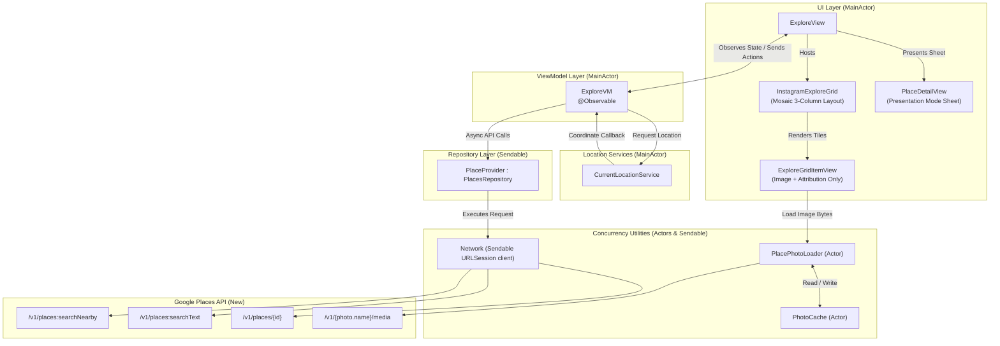
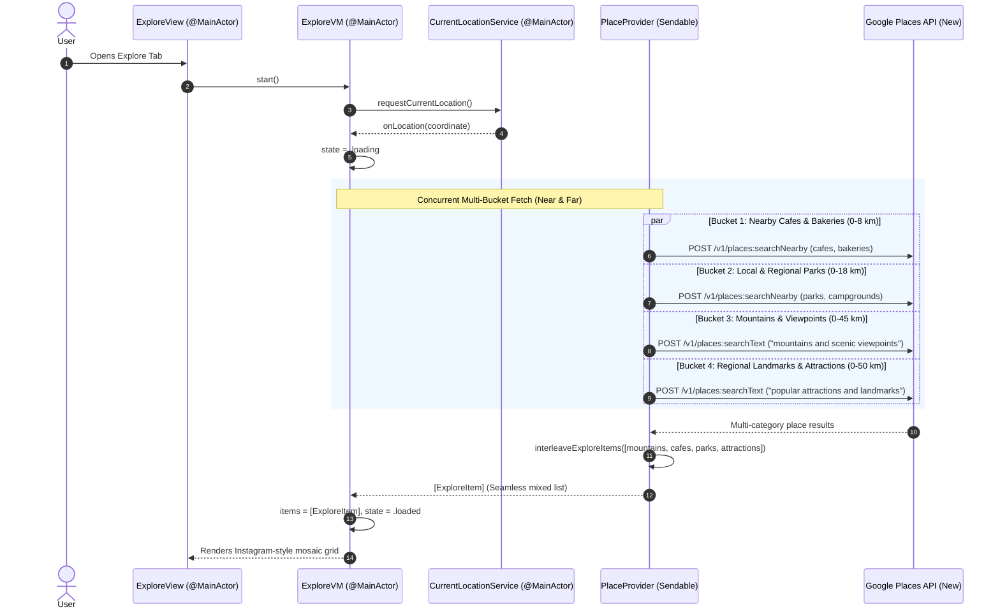
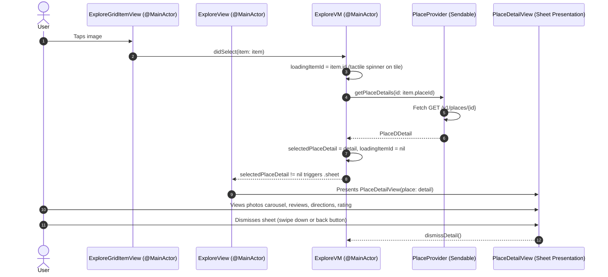

# Explore Section Data Flow & Architecture

This document describes the architectural design, Swift Concurrency discipline, and end-to-end data flow for the **Instagram Explore-Style** section in NearMe.

---

## 1. Architectural Principles & Separation of Concerns

The Explore section maintains clear separation of responsibilities:

1. **View Layer (`ExploreView`, `InstagramExploreGrid`, `ExploreGridItemView`)**:
   - Contains **strictly declarative UI** and layout geometry.
   - Implements an **Instagram Explore-style mosaic grid** with alternating 2x2 featured tiles and 1x1 standard tiles across 3 columns.
   - Observes state from `ExploreVM` via SwiftUI observation.
   - Contains zero business logic, zero networking, and zero location management.
   - In compliance with Google Places API policies, displays only the venue image and author attribution in each tile.
   - Routes user interactions (taps, search submissions) to ViewModel methods.

2. **ViewModel Layer (`ExploreVM`)**:
   - Serves as the state coordinator and intent handler.
   - Isolated to `@MainActor` to ensure UI state mutations occur safely on the main thread.
   - Coordinates with `CurrentLocationService` for geolocation and `any PlacesRepository` for remote data.
   - Holds published state (`items`, `state`, `selectedPlaceDetail`, `loadingItemId`, etc.).
   - No category filter restrictions: manages a rich, diverse stream of locations.

3. **Provider / Repository Layer (`PlaceProvider: PlacesRepository`)**:
   - Implements concurrent data retrieval from the Google Places API (New).
   - Concurrently fetches multiple diverse place buckets (cafes, mountains, parks, regional viewpoints) across both near and far distances (0–50 km).
   - Conforms to `Sendable` without mutable state; safe for concurrent calls across any task or actor.
   - Interleaves results so users experience an authentic visual variety.
   - Formats raw API responses into clean `Sendable` domain models (`ExploreItem`, `PlaceDDetail`).

4. **Service & Utility Layer (`PlacePhotoLoader`, `PhotoCache`, `Network`)**:
   - `PlacePhotoLoader` and `PhotoCache` are implemented as **`actor`**s to serialize concurrent cache operations and prevent image-fetching race conditions.
   - `Network` is a `final class: Sendable` wrapping `URLSession`.

---

## 2. Swift Concurrency Discipline & Role Breakdown

| Component | Concurrency Kind | Isolation | Rationale |
| :--- | :--- | :--- | :--- |
| `ExploreVM` | `final class` | `@MainActor` | Drives SwiftUI rendering through `@Observable`. Requires reference semantics for identity stability and `@MainActor` isolation to guarantee data-race-free UI mutations. |
| `PlacePhotoLoader` | `actor` | Actor-isolated | Coordinates concurrent image download requests across multiple grid cells, preventing duplicate downloads and protecting its internal session state. |
| `PhotoCache` | `actor` | Actor-isolated | Encapsulates in-memory `NSCache` reads/writes across concurrent tasks without locks or contention. |
| `PlaceProvider` | `final class` | `Sendable` (nonisolated) | Stateless data provider wrapping immutable `Network`. Being `Sendable` allows concurrent requests without serialization bottlenecks. |
| `Network` | `final class` | `Sendable` (nonisolated) | Wraps thread-safe `URLSession`. Immutable configuration (`let session`). |
| `CurrentLocationService`| `final class` | `@MainActor` | `CLLocationManagerDelegate` interacting with CoreLocation on the main run loop. |
| `ExploreItem` | `struct` | `Sendable` | Immutable value type safe to send across actor and thread boundaries. |
| `PlaceDDetail` | `struct` | `Sendable` | Immutable value type holding rich place details for sheet presentation. |

---

## 3. High-Level Architecture & Concurrency Boundaries

---

## 4. End-to-End Data Flow

### A. Initial Load & Multi-Bucket Concurrent Discovery (Near & Far)
The user is presented with a rich, unfiltered mix of locations (cafes, mountains, parks, viewpoints, attractions) both nearby and regionally distant.

---

### B. Instagram Mosaic Layout Algorithm

The grid items are grouped into repeating blocks of 6 items:
- **Block Index Even (0, 2, 4...)**:
  - Row 1: Large 2x2 featured tile on the **Left** + Two stacked 1x1 small tiles on the **Right**.
  - Row 2: Three 1x1 small tiles side-by-side.
- **Block Index Odd (1, 3, 5...)**:
  - Row 1: Two stacked 1x1 small tiles on the **Left** + Large 2x2 featured tile on the **Right**.
  - Row 2: Three 1x1 small tiles side-by-side.
- **Spacing**: 2pt hairline gap between all tiles, with edge-to-edge alignment.

---

### C. Place Detail Presentation Mode Flow
When the user clicks any photo in the Instagram Explore grid, that venue's complete details are loaded asynchronously and presented modally.

---

## 5. Visual Theme & Instagram Alignment

- **Edge-to-Edge Grid**: Full-bleed mosaic layout with 2pt hairline spacing.
- **Zero Categorical Filter Bars**: Unfiltered, diverse discovery feed.
- **Top Search Bar**: Clean rounded search field matching the Home section's styling with orange accents.
- **Photo-First Presentation**: Cells show only the full-bleed image and Google Places author attribution badge.
- **Sheet Presentation**: Native iOS modal presentation with grabber and interactive dismissal.
